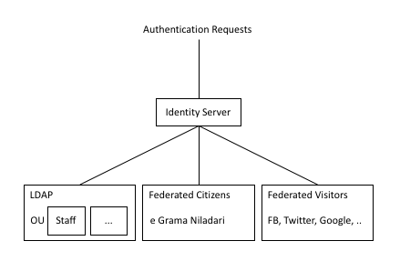

# Security Architecture

Security considerations for Elections System involve the following aspects:

* Access control via authentication and authorization to ensure only appropriate users are allowed to access the parts of the system they are authorized to.
* Data privacy for both data at rest and while being transferred to ensure no unauthorized or abusive actions are possible.
* Deployment security to ensure the integrity of the entire solution.

This document covers security architecture for all of these requirements.

## User Management

Every application and API access will require authentication and  authorization. Credentials and permissions will be granted based on the kind of user accessing and role(s).

Users are managed by the identity manager component with different user stores for the different kinds of users and by federating to external user management systems. 

The currently planned different kinds of users are the following:

* EC Staff - These users are regular (full time, part time, consulting) staff of the EC and will be coming from the internal LDAP user store.

* Election Staff - These users are those who are provisioned during the execution of a particular election. They will be given appropriate permissions that are valid only during that period and they will have no access after the election is over. These users will be kept in a separate OU (organization unit) within the same internal LDAP server.

* Citizens - These are citizens who are allowed to login and update their data. 
Election nominees are a specialisation of citizens. Electors are a specialisation of citizens. 

* E2G Users - These are various government organizations that require access to various EC systems either via the applications or via the API. These include Police.

* External Trusted Users - These are registered media organizations and developers that have been given API access to various APIs. 

* Visitors - These are random people from the Internet who visit the website and for whom we need some kind of authentication in order for them to perform transactions (such as reporting a violation). Note that with this approach we will never create users and passwords for any visitor.

### Architecture

  

### LDAP Design for EC Staff and Election Staff

LDAP will hold election commission staff and election staff. 
All users will be maintained in a flat OU structure. Corresponding to the 2 main user groups.
* Election Commission Staff
* Election Staff

Proposed OU Structure for Users

| User Types                    | OU
| ---                           | ---
| Election Commission Staff     | ou=staff,dc=ec,dc=gov,dc=lk
| Election Staff                | ou=election,dc=ec,dc=gov,dc=lk

**LDAP Groups**

A high level set of LDAP Groups will be defined as it allows to assign permissions at bulk level.
Additionally, app level user groups will be maintained in the LDAP.

### Federation for Citizens

The eGrama Niladari (eGN) project will be creating a digital identity (a username & password combination) for all citizens. What that mens is that the responsibiltiy for authenticating the user is taken by the eGN project and we will be able to ask for some information from them upon successful authentication of a particular user.

We will require the following attributes from the eGN identity provider:

* User ID
* Name
* Grama Niladari division
* Division
* District

### E2G Users

test

### Trusted External Users

test

### Federation for Visitors

We will support a selected set of social login systems to allow visitors to authenticate themselves. This list is flexible and as other Sri Lanka government services start offering digital identities and federation capability, we will keep adding more to this list.

Current list of social login identity providers:

* Facebook
* Twitter
* LinkedIn
* Google
* Microsoft

## API Security

Given the microservices and API based architecture of all the systems, API security becomes paramount. 

