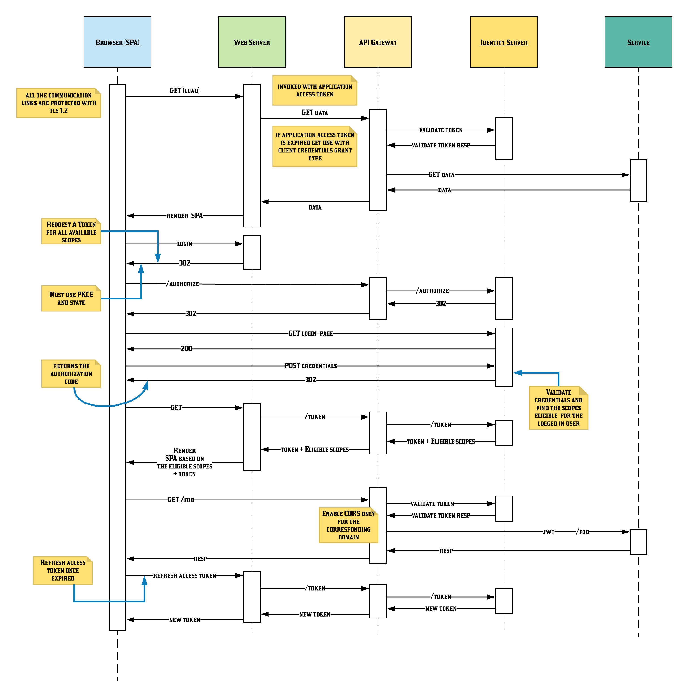
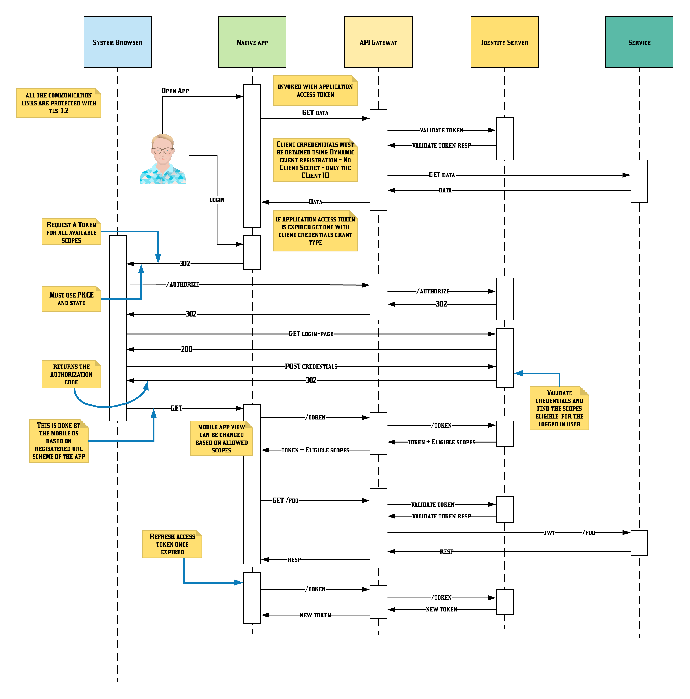

This documents describes the security architecture of the software platform for the Sri Lanka Elections Commission (EC) for the purpose of running elections for the GoSL: that is, to be able to run local government, provincial government, parliamentary and presidential elections as well as referendums.

## Objectives

* Make sure only the legitimate users have the right level access to the right resources at the right time for the right reason. 
* Preserve the privacy of all the data subjects by ensuring none of the data collected, stored, processed or derived by the system is used for none other than the original intention.
* Make all the users of the system accountable for all of their interactions with the system.
* Protect the integrity of the entire solution.

## Key Focus Areas

* User management
* Identity Federation
* Edge security
* Services to service communication
* Deployment security
* Managing Key and Credentials
* Auditing

## User Management

Every application and API access will require authentication and authorization. Credentials and permissions will be granted based on the kind of user accessing and role(s). Users are managed by the identity manager component with different user stores for the different kinds of users and by federating to external user management systems.

There are two type of user who interact with the web interfaces (SPAs) provided by the EC platform: internally managed and external managed users. For internal users, the EC platform is responsible for managing credentials, while for external users, EC platform relies on a federated identity provider to authenticate users.

### *Internally Managed Users*

* Election Commision Staff: These users are regular (full time, part time, consulting) staff of the Election Commision and will be coming from the internal LDAP user store.

* Election Staff: These users are those who are provisioned during the execution of a particular election. They will be given appropriate permissions that are valid only during that period and they will have no access after the election is over. These users will be kept in a separate OU (organization unit) within the same internal LDAP server.

* External Users from Trusted Authorities: These are various government organizations that require access to various EC systems either via the applications or via the API. These include Police.

* External Application Developers: These are registered media organizations and developers that have been given API access to various APIs.

### *Externally Managed Users*

* Citizens: These are citizens who are allowed to login and update their data. 

* Election Nominees: A specialisation of citizens. Electors are a specialisation of citizens. 

* Visitors: These are random people from the Internet who visit the website and for whom we need some kind of authentication in order for them to perform transactions (such as reporting a violation). Note that with this approach we will never create users and passwords for any visitor. 

### *Onboarding Staff Members*

### *Onboarding  External Users from Trusted Authorities*

This category of users require access to EC applications and APIs.   These users can be on-boarded in several ways.

1. Identity Server self-registration page and then approved by EC staff member
2. Bulk uploads via a CSV file
3. Federated from other government organization IdP
 
First and second type of users will be stored in a database as a secondary userstore of the identity server.
The third type of users will be federated from government organization IdP and it needs to be configured.  

In order to ensure security of the system in this scenario all unused accounts for last 30 days will be locked.

### *Onboarding External Application Developers*

External parties such as media organizations may require access to APIs. This category of users require API invocation, brows APIs, token generation functionality which is available in the store. 
API Users/Developers from external organizations can use the identity server self-registration to request for access. They will indicate that they need subscriber functionality.
EC staff members can verify the identity by offline means and approve the request using workflows.
After gaining access as subscriber these users they can perform,
* Browse APIs
* Generate Tokens
* Invoke APIs

### *Provisioning Federated Users*

### *User Store Design for EC Staff and Election Staff*

LDAP will hold election commission staff and election staff. 
All users will be maintained in a flat OU structure. Corresponding to the 2 main user groups.
* Election Commission Staff
* Election Staff

Proposed OU Structure for Users

| User Types                    | OU
| ---                           | ---
| Election Commission Staff     | ou=staff,dc=ec,dc=gov,dc=lk
| Election Staff                | ou=election,dc=ec,dc=gov,dc=lk

A high level set of LDAP Groups will be defined as it allows to assign permissions at bulk level.
Additionally, app level user groups will be maintained in the LDAP

## Identity Federation

### *Federation for Citizens*

The eGrama Niladari (eGN) project will be creating a digital identity (a username & password combination) for all citizens. What that mens is that the responsibiltiy for authenticating the user is taken by the eGN project and we will be able to ask for some information from them upon successful authentication of a particular user.

We will require the following attributes from the eGN identity provider:

* User ID
* Name
* Grama Niladari division
* Division
* District

### *Federation for Visitors*

We will support a selected set of social login systems to allow visitors to authenticate themselves. This list is flexible and as other Sri Lanka government services start offering digital identities and federation capability, we will keep adding more to this list.

Current list of social login identity providers:

* Facebook
* Twitter
* LinkedIn
* Google
* Microsoft

## Edge Security

Under this section we discuss how to protect the system from end users. These end users can be  human users or other systems. A system  can access another system just by been itself or on behalf of a human user (or another system). The entry point for human users into the system is a Single Page Application (SPA) or native mobole application and for the systems, APIs. Following sections cover in detail, security with respect to each entry point.

### *Single Page Application Login for Internally Managed Users*

The following diagram illustrates the flow of interactions of a human user with a single page application.

  

### *Native Mobile Application Login for Internally Managed Users*

The following diagram illustrates the flow of interactions of human user with a native mobile application.

  

### *Single Page Application Login for Externally Managed Users*

### *Native Mobile Application Login for Externally Managed Users*

### *Securing APIs*

The plaform exposes all it's functionality to all the dependant components (e.g. SPA, mobile app) via APIs. 

### *Authorization*

# Service to Service Communication

## Authentication

## Authorization

# Deployment Security

# Managing Key and Credentials

# Auditing
